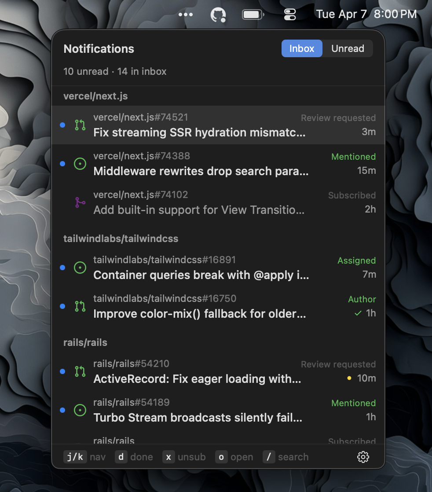

# Octodot

Octodot is a native macOS menu bar app for triaging GitHub notifications with a keyboard-first workflow. It is built for fast inbox processing.



## Overview

Octodot lives in the macOS menu bar and opens a focused notifications panel. It is designed for quick review and triage without keeping the GitHub inbox open in a browser.

Current behavior includes:

- unread badge state in the menu bar icon
- `Inbox` and `Unread` inbox modes
- `Inbox` is designed to feel closer to GitHub's active inbox rather than a raw archive feed
- repository grouping with recency-aware ordering
- optimistic local actions that survive refreshes and relaunches
- background polling that respects GitHub polling headers
- configurable global shortcut
- Vim-style navigation and commands
- native settings window for account, appearance, and shortcuts
- pull request CI status indicators in the list
- Dependabot/security alerts layered into `Inbox`

## Installation

```sh
brew install jasonlong/tap/octodot
```

Then launch Octodot and sign in with a [classic GitHub PAT](https://docs.github.com/en/authentication/keeping-your-account-and-data-secure/managing-your-personal-access-tokens#creating-a-personal-access-token-classic) with `notifications` and `repo` scopes.

## Authentication

Octodot currently uses a **classic GitHub Personal Access Token** with the `notifications` and `repo` scopes.

The app validates the token against GitHub, then stores it in the macOS Keychain.

## Shortcuts

The app is intentionally keyboard-centric.

- `j` / `k`: move selection
- `Up` / `Down`: move selection
- `Space`: toggle the current row's selection for bulk actions (`d`, `x`, `o` apply to every checked row when the set is non-empty)
- `ctrl-f`: page down
- `ctrl-b`: page up
- `ctrl-d` / `ctrl-u`: half-page down / up
- `gg` / `G`: jump to top / bottom
- `Home` / `End`: jump to top / bottom
- `o` or `Return`: open in browser and mark read
- `d`: mark done
- `x`: unsubscribe
- `u`: undo queued action (available for a few seconds)
- `y`: copy URL
- `a`: toggle `Inbox` / `Unread`
- `s`: toggle repo grouping
- `/`: enter search
- `return` or `tab` in search: keep filter, return to list
- `esc` in search: clear filter, return to list
- `r`: force refresh
- `Esc`: close panel

Global hotkey:

- configurable in Settings
- defaults to `⌘'`

## Settings

Octodot includes a native settings window with:

- `Account`: sign in, update token, sign out
- `Appearance`: `System`, `Light`, or `Dark`
- `Shortcuts`: global shortcut recorder and full panel keybinding reference
